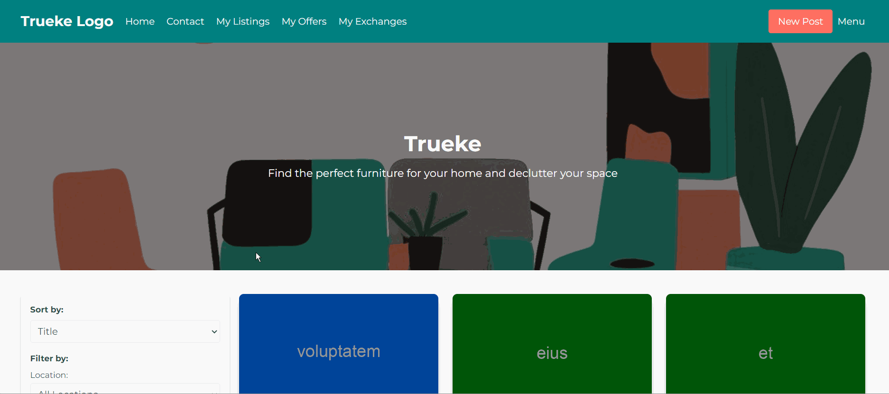
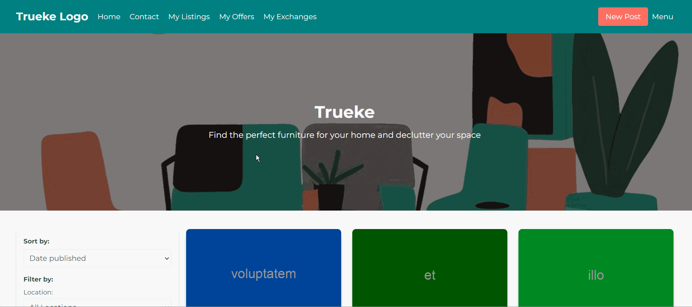
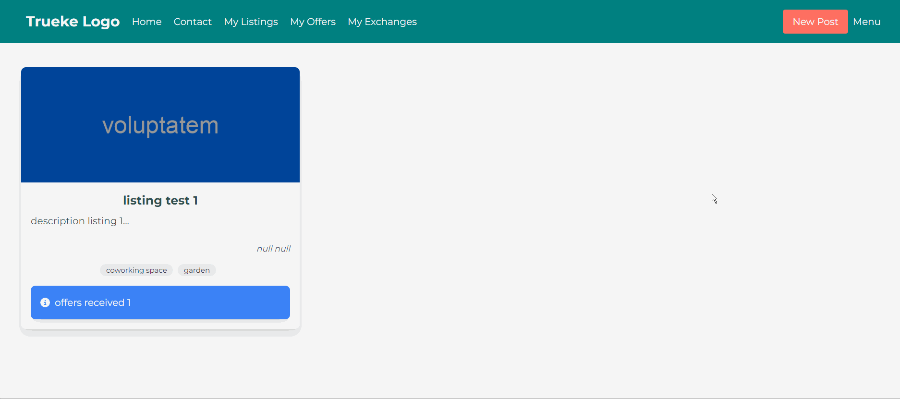

# Trueke
Trueke facilitates the exchange of furniture items among individuals, promoting sustainability and community interaction. Users can effortlessly list their unwanted furniture, specifying desired items for exchange. Other members within the same region or city can view these listings and make offers for exchanges.

## Tech stack
- Laravel PHP
- Angular
- TailwindCSS
- PostgreSQL

## Run project
Follow the instructions on each README file included in `trueke` and `trueke-front` folders.

## Video Samples

## Contact
For inquiries or feedback, feel free to contact me:

- Email: [joa_gzb@hotmail.com]
- [My Portfolio]([URL](https://joagzb.notion.site/Joaquin-s-Portfolio-a90cb2e35b3b41baa73489b26ffa1461?pvs=4))
- LinkedIn: [https://linkedin.com/in/joaquin-gonzalez-budino]
