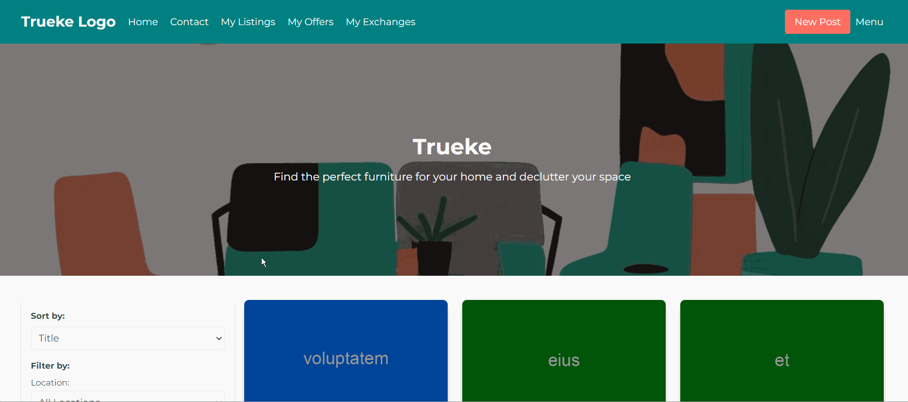
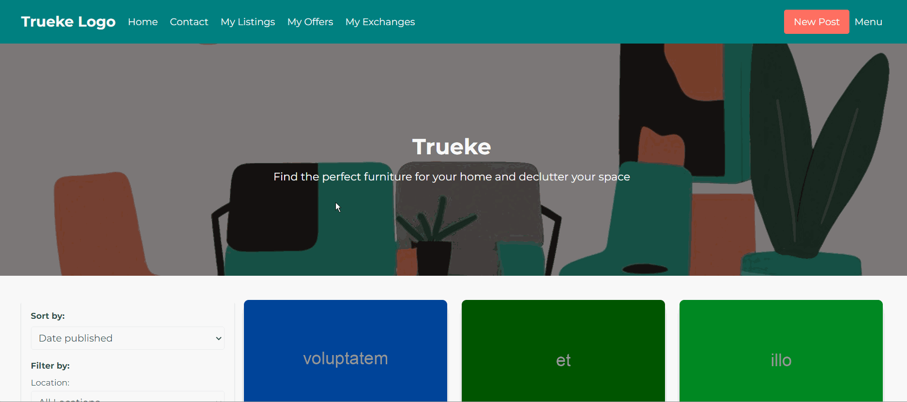
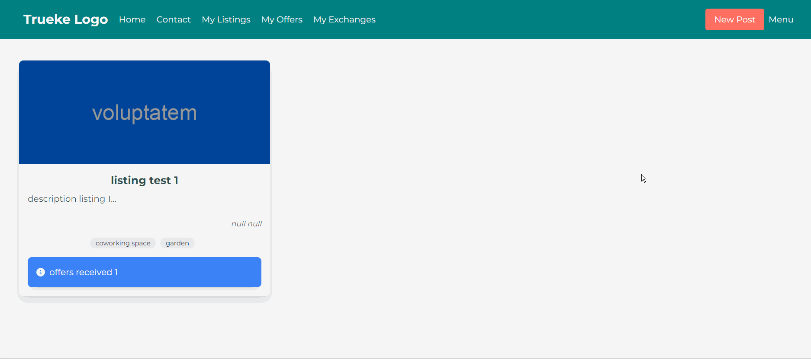

# Trueke
Trueke facilitates the exchange of furniture items among individuals, promoting sustainability and community interaction. Users can effortlessly list their unwanted furniture, specifying desired items for exchange. Other members within the same region or city can view these listings and make offers for exchanges.

## Tech stack
- Laravel PHP
- Angular
- TailwindCSS
- PostgreSQL

## Run project locally

1. **Start the API**

   ```bash
   cd trueke
   cp .env.example .env   # update database settings as needed
   composer install
   php artisan migrate --seed   # optional seed data
   php artisan serve
   ```

   The API is available at [http://localhost:8000](http://localhost:8000).

2. **Start the frontend**

   ```bash
   cd trueke-front
   npm install
   npm start
   ```

   Visit the app at [http://localhost:4200](http://localhost:4200).

For additional details and Docker options, see the README files in `trueke` and `trueke-front`.

## Video Samples









## Contact
For inquiries or feedback, feel free to contact me:

- Email: [joa_gzb@hotmail.com]
- [My Portfolio]([URL](https://joagzb.notion.site/Joaquin-s-Portfolio-a90cb2e35b3b41baa73489b26ffa1461?pvs=4))
- LinkedIn: [https://linkedin.com/in/joaquin-gonzalez-budino]
